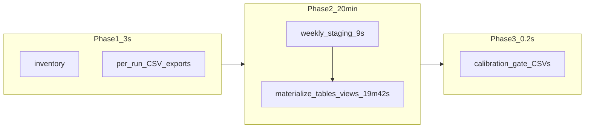

# Batch execution analysis and 52-week improvement backlog

## What this run tells us

Your completed run ([`batch_20260610_152329_utc/batch_overview.log`](D:/FinanceProjects/edgarDataManagementPython/logs/tradingview_analysis/prediction_analysis/batch_pattern_analysis/batch_20260610_152329_utc/batch_overview.log)) finished in **~20 minutes** for **4 ISO weeks**:

| Phase | Time | Share |
|-------|------|-------|
| Phase 1: inventory + per-run exports | 3.0s | 0.25% |
| Phase 2: history aggregation | 19m 51s | 99.7% |
| Phase 3: calibration CSV exports | 0.2s | ~0% |

Within phase 2, stderr shows the split clearly:

- **Staging** (4 weekly DBs → `stg_input_*`): **~9s total** (~1.4M rows across 18 runs)
- **Materialization** (`_materialize_sql_native_history_tables`): **~19m 42s** (everything after the last `history-stage` line)

So the recent incremental loader fix worked: **input ingestion is no longer the bottleneck**. The cost moved to **one big SQL build at the end**.

### Input scale (weeks 21–24)

- **18 selected runs** (one full-coverage day per weekday where available)
- **~1.43M staged rows** (10 profiles × ~3.9k–10.5k symbols per run)
- Mixed backfill weeks (~10.5k scan rows) vs live weeks (~3.9k) — staging row counts track that mix

Phase 1 per-run exports stay cheap because they only query **one primary profile** (`breakout_long`) with `LIMIT 50` leaders — not the full 10-profile universe.

---

## Extrapolation to 52 weeks (rough order of magnitude)

Assuming ~**5 runs/week** (similar to weeks 21–23):

| Metric | 4 weeks (actual) | 52 weeks (estimate) |
|--------|------------------|---------------------|
| Selected runs | 18 | ~234 |
| Staged rows | 1.43M | ~18–21M |
| Staging time | ~9s | ~2–3 min (near-linear) |
| Materialization | ~20 min | **~4–10+ hours** (likely worse than linear) |

Materialization is probably **superlinear** because [`_materialize_sql_native_history_tables`](D:/FinanceProjects/edgarDataManagementPython/src/data_analysis_scripts/trading_view_move_prediction_history_aggregator.py) builds:

- Window-heavy `all_profiles_history` over all staged rows
- **Wide pivot tables** with one column per snapshot label (`snap__*`) — grows with every run day
- **10 per-profile table families** (history, summary, price progression, 4 horizon score progressions each)
- Calibration views (`vw_profile_horizon_progression_core`, `vw_profile_horizon_alignment_stats`) that read from those wide progression tables

At 52 weeks (~234 snapshot columns in wide tables), pivot SQL and duplicate per-profile builds become the dominant cost — not the 9s staging step.

**Bottom line:** 20 minutes for 4 weeks is acceptable; **unmodified 52-week full rebuild is not** without architectural changes.

---

## Thoughts on current config

From [`batch_overview.log`](D:/FinanceProjects/edgarDataManagementPython/logs/tradingview_analysis/prediction_analysis/batch_pattern_analysis/batch_20260610_152329_utc/batch_overview.log):

- **`include_profiles` = all 10 baseline profiles** — correct for calibration gates, but multiplies staged rows ~10× vs single-profile runs
- **`history_parallel_workers=12`** is logged but **not used** in incremental mode ([`run_move_prediction_history_aggregation_duckdb_incremental`](D:/FinanceProjects/edgarDataManagementPython/src/data_analysis_scripts/trading_view_move_prediction_history_aggregator.py) forces `max_parallel_workers=1` for staging safety)
- **`prefer_parquet_inputs=True`** — staging stayed fast; worth keeping parquet sidecars on weekly source DBs
- **Phase 3 is trivial** — batch workflow value is in phase 1 CSVs + phase 2 history DB; calibration export is just 3 view queries

---

## Prioritized improvement backlog (for 52+ weeks)

### Tier 1 — Highest impact (architecture)

1. **Batch calibration slim mode**
   - Add a flag on [`run_batch_prediction_pattern_analysis`](D:/FinanceProjects/edgarDataManagementPython/src/data_analysis_scripts/trading_view_move_prediction_batch_pattern_analysis.py) (e.g. `calibration_detail="gates_only"`) that materializes only what [`export_calibration_reports`](D:/FinanceProjects/edgarDataManagementPython/src/data_analysis_scripts/trading_view_move_prediction_batch_pattern_analysis.py) needs:
     - `all_profiles_history` + summary (or a long-format progression table)
     - Views: `vw_profile_horizon_progression_core`, `vw_profile_horizon_alignment_stats`
   - **Skip** for batch: wide `snap__*` score/price progression matrices, `cross_comparison`, and 10× per-profile duplicate table sets unless explicitly requested
   - Expected gain: largest single reduction in 52-week materialization time

2. **True incremental / rolling history DB**
   - Persist a canonical `historical_prediction_analysis.duckdb` under e.g. `calibration/rolling/`
   - On each batch run: stage **only new weeks/runs**, append to history tables, refresh views — **no full rebuild**
   - Enables incremental week adds (run weeks 21–24, then 25–28 later) without reprocessing prior weeks

3. **Checkpoint + resume after sleep/interrupt**
   - Save per-week staging artifacts (or week-scoped mini history DBs) under the batch output dir
   - On restart: skip completed weeks in phase 1 and phase 2 staging; only materialize missing chunks + merge
   - Addresses your sleep/interrupt concern directly

### Tier 2 — Medium impact (operational)

4. **Split phase 2 timing in `batch_overview.log`**
   - Record `history_staging_seconds` vs `history_materialize_seconds` (visible in stderr today but not persisted in overview)
   - Makes future tuning measurable week-over-week

5. **Chunked batch API**
   - Parameters: `chunk_weeks=4`, `resume_from_batch_dir=...`
   - Run 52 weeks as 13 sequential chunks with merge — bounded memory, resumable, clearer ETAs

6. **Optional phase 1 skip**
   - If `by_week/week=NN/` already exists and `force_refresh=False`, skip re-exporting per-run CSVs
   - Saves little today (~3s) but avoids redundant I/O on reruns

7. **Profile scope controls for screening vs full calibration**
   - Keep 10 profiles for promotion gates, but allow `include_profiles=["breakout_long", ...]` for exploratory 52-week sweeps
   - Or two-stage: fast 1–3 profile screen → full 10-profile calibration on promising windows

### Tier 3 — Lower impact / tuning

8. **Materialization sub-timing**
   - Log duration per table family inside `_materialize_sql_native_history_tables` (history, summary, wide progression, per-profile loops) to confirm which SQL blocks explode at scale

9. **DuckDB pragmas for batch materialization**
   - Tune `threads`, `memory_limit`, `temp_directory` on fast NVMe for the single heavy materialize pass
   - Diminishing returns vs slim mode, but cheap to try

10. **Ensure weekly source DBs always have `parquet/profile_prediction_rows.parquet`**
    - Staging already ~2–3s/week when parquet exists; avoids fallback table scans on large backfill DBs

11. **Reduce run selection for calibration-only passes**
    - e.g. `max_runs_per_week=1` or sample weekdays — cuts row count linearly (trade-off: weaker gate statistics)

12. **Defer or lazy-build non-batch artifacts**
    - Per-profile wide matrices are useful for research notebooks but not required for `calibration_gate_summary.csv`

---

## Recommended next step (if you want implementation)

Start with **Tier 1 item 1 (slim calibration mode)** plus **item 4 (split timing in overview log)** — smallest code change with the best ROI before investing in rolling DB merge logic.

Validation benchmark after changes:

- Re-run weeks 21–24 and compare `history_materialize_seconds`
- Project 52-week ETA from materialize seconds per staged row (not total wall clock)
