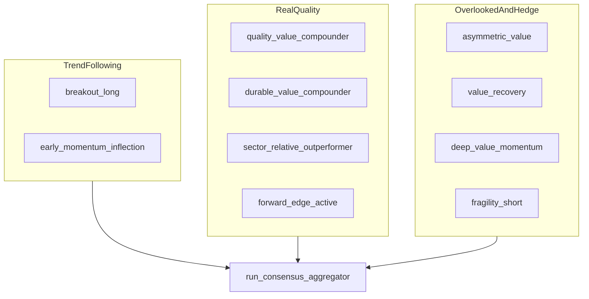
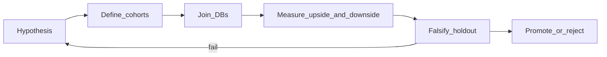

# Active Manager Profile & Pattern Discovery Plan

> **Audience:** Retail active manager with **$100k+** capital deployed or ready to deploy.  
> **Goal:** Refine active management for better **risk-adjusted returns** — upside opportunity with explicit downside skepticism.  
> **Generated:** June 2026  
> **Sources:** `trading_view_stock_fields.csv` (3,515 fields), 10 scoring profiles, DuckDB prediction + all-fields stores.

---

## Executive summary

Your system has two complementary data layers:

1. **Prediction analysis** (`run_full_analysis_suite_duckdb`) — 10 differentiated profiles, consensus meta-ranking, risk tiers, and `manager_action_signal` labels over ~159 scored signals.
2. **All-fields export** (`export_all_tradingview_fields_duckdb`) — the full TradingView catalog (3,515 columns) stored daily in DuckDB for research.

The gap is large: **~95% of catalog fields are not used in scoring today**. The profiles are well-differentiated after the May 2026 retune, but three problems remain for a $100k+ retail book:

- **Sleeve overlap** — value profiles and tactical profiles can surface the same names without true diversification.
- **Confirmation blind spots** — Donchian, Hull MA, Chaikin Money Flow, Bull/Bear Power, and Parabolic SAR exist in the catalog but play no role in ranking.
- **No formal calibration loop** — alignment views and false-positive queries exist, but are not yet a mandatory weekly discipline.

This plan proposes **profile tuning**, **six new opportunity lenses**, and a **skeptical pattern-discovery workflow** that joins prediction runs, all-fields exports, and historical aggregation.

**Implementation backlog:** [implementation_todos.md](implementation_todos.md)

---

## Part 1 — Profile improvements

### 1.1 Capital sleeve model ($100k+ retail PM)

Do not size from conviction alone. Allocate capital by **horizon and role** first, then let model scores choose names inside each sleeve.

| Sleeve | Budget | Primary profiles | Horizon | Role |
|--------|--------|------------------|---------|------|
| **Tactical** | 15–25% | `breakout_long`, `early_momentum_inflection`, earnings-priority consensus | days → weeks | Capture momentum; rotate quickly |
| **Core compounder** | 40–55% | `quality_value_compounder`, `durable_value_compounder`, `sector_relative_outperformer` | months → years | Structural alpha; lowest turnover |
| **Opportunistic value** | 15–25% | `asymmetric_value`, `value_recovery`, `deep_value_momentum` | weeks → months | Mispricing + catalyst; higher idiosyncratic risk |
| **Hedge / defensive** | 5–15% | `fragility_short`, cash, future `defensive_fortress` | weeks | Downside protection; not an alpha sleeve |
| **Cash reserve** | 10–20% | — | — | Dry powder for confirmation entries |

**Retail constraints to enforce on every name:**

- **Liquidity:** Intended position size must not exceed ~5% of `AvgValue.Traded_10d` (ideally < 3 days to exit).
- **Concentration:** Max 8–12% per position; max ~25% per sector unless explicitly thematic.
- **Instrument quality:** `type = 'stock'` and primary listing only — avoid fund/trust structural cheapness.
- **Confirmation:** No full tactical size on first appearance; add on multi-lens agreement or second-week persistence.

See also: [position_sizing_distribution_framework.md](../position_sizing_distribution_framework.md).

---

### 1.2 Current profile map

Profiles are organized into three investment ideas (from [profile weighting reference](../tradingview_move_prediction_profile_weighting_reference.md)):



**Consensus weights (empirical prior):** `breakout_long` 0.20, `early_momentum_inflection` 0.12, `forward_edge_active` 0.11, `quality_value_compounder` 0.10, `durable_value_compounder` 0.09, others 0.05–0.09, `fragility_short` 0.07 (sign-inverted).

---

### 1.3 Structural gaps and overlap risks

| Issue | Evidence | Impact on $100k book |
|-------|----------|---------------------|
| Universe-relative scores | MAD normalization on each run's `scan_data` only | Rankings change when universe changes; use per-industry reruns for peer-pure decisions |
| Value-cluster similarity | `asymmetric_value`, `value_recovery`, `deep_value_momentum` share valuation + quality DNA | Same cheap name can fill 2–3 sleeves — illusory diversification |
| Tactical cluster similarity | `breakout_long` vs `early_momentum_inflection` both weight attention/momentum heavily | Need explicit coiled → breakout handoff rules |
| No income/dividend lens | Dividend fields exist but no dedicated profile | Income-oriented positions lack a native ranking home |
| No exhaustion lens | All long profiles are momentum-favoring or momentum-forgiving | Late-cycle breakouts can draw full tactical size before reversal |
| Fund/trust contamination | Partially addressed via `type`/`typespecs` in scan payload | Still require explicit stock filter in shortlists |
| Catalog under-utilization | 3,515 fields vs ~159 scored signals | Free confirmation and divergence data left on the table |

**March 2026 overlap issue (now largely fixed):** `balanced` vs `quality_value_compounder` showed 10/10 top-10 overlap. `balanced` was removed; alias maps to QVC. Re-audit overlap after any profile change using top-10 Jaccard per horizon.

---

### 1.4 Recommended tuning — existing 10 profiles

#### `breakout_long` — confirmed upside continuation

**Use for:** Tactical long entries with volume-backed momentum.  
**Tune:**
- Add **false-breakout guardrails** via catalog signals: `donchian_position` (near upper DonchCh20), `close_vs_psar`, `chaikin_money_flow_signal > 0`.
- **Down-rank** when: RSI > 70 or Stoch.RSI.K > 80, `Perf.1M` in top decile (already extended), `price_target_dispersion` in top quartile.
- Keep `quality = 0.00` at days horizon — do not dilute tactical purity.

**SQL validation:** `q_breakout_long_false_breakout_screen`, `q_breakout_long_fragility_disagree`, `q_breakout_long_raw_volume_confirm`.

#### `early_momentum_inflection` — nascent moves before crowd confirmation

**Use for:** Watchlist and starter positions before breakout confirmation.  
**Tune:**
- Add `close_vs_hullma9` (fastest MA confirmation) and `bbpower_divergence` (bullish divergence / early reversal).
- Keep `aroon_spread` and `bb_squeeze` as primary coiled-energy signals.
- **Handoff rule:** Promote to `breakout_long` sleeve when breakout weeks score exceeds inflection score AND `volume_trend > 1.05` AND `ADX+DI > ADX-DI`.

**SQL validation:** `q_early_inflection_coiled_energy`, `q_early_inflection_vs_breakout_handoff`.

#### `forward_edge_active` — what is getting better?

**Use for:** Weeks-to-months early catchers with forward EPS and QoQ acceleration.  
**Tune:**
- Pair with `run_full_analysis_suite_with_earnings_priority_duckdb` during earnings season.
- Reward **pre-earnings drift**: positive `eps_surprise_percent_fq` history + coiled tape 2–4 weeks before `earnings_release_next_date`.
- Keep attention inversion (0.50×/1.50×) — crowded names should not dominate.

**Reference:** [pre_earnings_profile_analysis.md](../pre_earnings_profile_analysis.md).

#### `quality_value_compounder` — durable quality identification

**Use for:** Core long holdings where profitability persistence matters more than cheapness.  
**Tune:**
- Maintain heaviest missing-quality penalties and `scale = 0.00`.
- Do **not** add deep value requirements — that is `durable_value_compounder`'s job.
- **Rule:** If QVC and DVC months scores correlate > 0.8 for a symbol, hold only the higher-conviction one at full size.

#### `durable_value_compounder` — quality-led value investing

**Use for:** Months/years positions requiring cheapness **and** durable cash generation.  
**Tune:**
- Enforce minimum valuation evidence: FCF yield, EV/FCF, Graham/tangible book gaps must be present or heavy fallback penalties apply.
- Activate extended safety stack: interest cover, Zmijewski (inverted), cash-to-debt ratios.
- Prefer over QVC when you need a valuation anchor, not just quality leadership.

#### `sector_relative_outperformer` — best-in-class operators

**Use for:** Core positions in sectors you understand; run per-industry for peer purity.  
**Tune:**
- Emphasize `volume_trend` (accumulation) over raw volume spikes.
- Add `chaikin_money_flow_signal` and `ebitda_per_employee` when Phase 2 signals ship.
- Use `pivot_distance` for monthly support confirmation on add decisions.

#### `asymmetric_value` — overlooked operating-company value

**Use for:** Names you believe the market has over-discounted.  
**Entry state:** Cheap on multiple axes + operating floor (ROIC, Piotroski, FCF margin) + **low** momentum (weak tape forgiven, not rewarded).  
**Tune:** Keep momentum bias damped (+0.70×/−0.45×). Safety negative at −1.40× is the value-trap guard — do not soften.

#### `value_recovery` — turnaround with sequential improvement

**Use for:** Rerating candidates with ugly recent tape but improving fundamentals.  
**Entry state:** QoQ growth inflection + `stoch_rsi_crossover` + `short_trend_emergence` as **triggers**, not background.  
**Tune:** Keep momentum negative bias at 0.60× (most forgiving long profile). Require valuation + safety evidence.

#### `deep_value_momentum` — aggressive value plus catalyst

**Use for:** Value-driven but **active** entries — cheap enough to matter, already moving.  
**Entry state:** Deep discount + `stoch_rsi_crossover` + sequential FCF/NI improvement. Bridge between value and momentum sleeves.  
**Tune:** Do not use for months/years core — this is opportunistic value sleeve only.

#### `fragility_short` — hedge / short watch basket

**Use for:** Risk overlay, not alpha generation.  
**Tune:**
- Require `fragility_short` top-quartile **and** disagreement from ≥2 long profiles before `hedge_or_short` action.
- Cap hedge sleeve at 10–15% notional.
- Safety weight 0.57 at years horizon is intentional — balance-sheet deterioration is the primary signal.

---

### 1.5 Proposed new profiles (6 opportunity lenses)

| Profile | Thesis | Horizon | Key catalog fields | Capital sleeve | Overlap risk |
|---------|--------|---------|-------------------|----------------|--------------|
| **`income_compounder`** | Dividend **growth** with FCF/dividend coverage — not yield chasing | months → years | `dividend_payout_ratio_ttm`, `cash_dividend_coverage_ratio_ttm`, `dps_*`, `dividend_yield_recent`, Altman Z | Core 10–20% | Medium vs DVC |
| **`pre_earnings_drift`** | Positive surprise history + coiled tape into earnings window | days → weeks | `eps_surprise_percent_fq`, `earnings_release_next_date`, `bb_squeeze`, `range_compression` | Tactical 5–10% | Medium vs `forward_edge_active` |
| **`mean_reversion_exhaustion`** | Overextended leaders — trim, avoid new longs, hedge watch | days → weeks | `RSI`, `Stoch.RSI`, `CCI20`, `distance_from_52w_high`, `Perf.1M` penalty | Risk overlay | Low — inverse lens |
| **`defensive_fortress`** | Low beta, net cash, dividend, strong Z-score for drawdown periods | months → years | `net_cash_to_market_cap`, `beta_1_year`, `altman_z_score_ttm`, cash coverage ratios | Defensive 10–20% | Medium vs QVC safety weight |
| **`sector_rotation_momentum`** | Industry-relative momentum + efficiency leadership | weeks → months | Industry-normalized `Perf.*`, `revenue_per_employee`, CMF | Tactical 10–15% | High vs `sector_relative_outperformer` — requires per-industry scan |
| **`quality_growth_at_reasonable_price`** | GARP bridge: growth + ROIC at reasonable forward P/E | months | `price_earnings_forward_fy`, `eps_forward_growth`, `sustainable_growth_rate_ttm`, ROIC | Core 15–25% | Medium vs QVC + `forward_edge_active` |

**Phase 2 (external data required):**

- `short_squeeze_candidate` — needs short interest (not in TradingView catalog).
- `insider_accumulation` — EDGAR Form 4 integration (data exists in repo pipeline).

---

### 1.6 Field activation priority (catalog → scoring)

**Catalog facts (June 2026):**
- **3,515** total API fields in `savedData/trading_view_stock_fields.csv`
- **~1,004** unique base field families (rest are multi-timeframe variants: `|1`, `|5`, `|1W`, etc.)
- **~159** candidate signals in the scoring engine
- **~2512** multi-timeframe variant columns (mostly unused)

#### Tier 1 — activate first (in catalog, low implementation risk, high confirmation value)

| Catalog fields | Proposed signal | Profiles |
|----------------|-----------------|----------|
| `DonchCh20.Upper`, `DonchCh20.Lower` | `donchian_position` | `breakout_long`, `early_momentum_inflection` |
| `P.SAR` | `close_vs_psar` (+1/−1) | `breakout_long`, `early_momentum_inflection` |
| `HullMA9` | `close_vs_hullma9` (+1/−1) | `early_momentum_inflection`, `forward_edge_active` |
| `ChaikinMoneyFlow` | `chaikin_money_flow_signal` | `breakout_long`, `sector_relative_outperformer` |
| `BBPower` | `bbpower_divergence` | `early_momentum_inflection`, `value_recovery`, `mean_reversion_exhaustion` |

Catalog counts: DonchCh 30, HullMA 40, Ichimoku 90, ChaikinMoneyFlow 10, BBPower 20, P.SAR 10, Candle patterns 270.

#### Tier 2 — fundamental depth (mostly extended signals already; wire into profiles)

| Fields | Use |
|--------|-----|
| `ebitda` + `number_of_employees` → `ebitda_per_employee` | Efficiency beyond revenue/head |
| `*_cagr_5y` (FCF, revenue, net income, EPS) | Durable compounder proof |
| `sloan_ratio_ttm` (inverted) | Earnings quality / accrual red flag |
| `zmijewski_score_ttm` (inverted) | Distress probability |
| `dividend_payout_ratio_ttm`, `cash_dividend_coverage_ratio_ttm` | Income compounder profile |

#### Tier 3 — multi-timeframe stack (defer until Tier 1 validated)

| Idea | Fields |
|------|--------|
| Timeframe disagreement | `Recommend.All|1W` vs `Recommend.All` spread |
| Weekly vs daily momentum divergence | `change|1W` vs `change` |
| Intraday confirmation | `change|60`, `volume|60` — only if tactical sleeve expands |

**Do not brute-force 3,515 columns.** Pre-register 10–20 hypotheses per review cycle. See Part 2.

---

## Part 2 — Pattern discovery strategy

### 2.1 Skeptical discovery loop

The goal is not to find patterns that **look** good in one run. The goal is to find signals that **survive** scrutiny across time, universes, and downside scenarios.



#### Non-negotiable skepticism rules

1. **No single-run conclusions.** Minimum 2 snapshots (`snapshots_seen >= 2`); prefer ≥4 weekly runs before promotion.
2. **Universe relativity.** Re-test on all-universe AND per-industry scans. A "cheap" stock globally may be expensive within its sector.
3. **Look-ahead awareness.** In-run `Perf.*` tracking compares rankings to **trailing** performance on the same row — it is alignment diagnostics, not a forward backtest. Use `historical_prediction_analysis.duckdb` for realized `close_return_pct_total`.
4. **Multiple-testing discipline.** With 3,515 fields, exploratory SQL will find spurious correlations. Pre-register hypotheses. Note Bonferroni/FDR when mining without prior theory.
5. **False-positive taxonomy.** Every promoted rule must be tested against `q_hist_false_positives` and `q_hist_snapshot_mismatch` cohorts.
6. **Liquidity reality.** Exclude names where your intended position > 5% of `AvgValue.Traded_10d`. A perfect signal you cannot trade at size is not actionable for a $100k book.

---

### 2.2 Three-database architecture

| Database | Path pattern | Primary tables / views | Answers |
|----------|--------------|------------------------|---------|
| **A — Prediction** | `prediction_analysis/duckdb_runs/iso_year=*/week=*/move_prediction_*.duckdb` | `profile_horizon_scores`, `profile_components`, `consensus_horizon_scores`, `raw_scan_rows` | Which profile/score combinations rank well? |
| **B — All-fields** | `trading_view_all_fields_data/<dd_mm_yyyy>/tradingview_all_fields_*.duckdb` | `all_fields_rows` (3,519 VARCHAR columns) | What raw features separate winners from losers? |
| **C — History** | `historical_prediction_analysis/runs/*/historical_prediction_analysis.duckdb` | `vw_profile_horizon_alignment_stats`, `vw_profile_horizon_progression_core`, `vw_profile_horizon_snapshot_deltas` | What persisted and calibrated over weeks? |

**Join key:** `symbol` with exchange-prefix normalization (see `RAW_SYMBOL_JOIN` in `trading_view_investment_shortlist_pipeline.py`).

#### Template: false-positive field autopsy (conceptual SQL)

```sql
-- Join prediction leaders that failed with all-fields raw data
WITH false_pos AS (
    SELECT profile_name, symbol, score_delta_total, close_return_pct_total
    FROM vw_profile_horizon_progression_core
    WHERE score_delta_total > 0 AND close_return_pct_total < 0
)
SELECT fp.*, a."RSI", a."ChaikinMoneyFlow", a."total_debt_to_ebitda_fq",
       a."price_target_high", a."price_target_low"
FROM false_pos fp
JOIN all_fields_rows a ON fp.symbol = a.symbol
WHERE a.run_id = '<matching_all_fields_run_id>';
```

Use this to discover **downside signatures** — what raw fields appear disproportionately among false positives?

---

### 2.3 Weekly retail PM workflow

| Day | Action | Tool |
|-----|--------|------|
| **Monday** | `run_full_analysis_suite_duckdb` (+ earnings-priority if catalyst week) | `src/main.py` |
| **Monday** | `export_all_tradingview_fields_duckdb` (weekly research snapshot) | `src/main.py` |
| **Tuesday** | `run_investment_shortlist_pipeline` → review action buckets | Shortlist CSVs |
| **Wednesday** | Aggregate last 4–8 weeks → history DB | `run_move_prediction_history_aggregation_duckdb` |
| **Thursday** | Run `q_hist_profile_calibration`, `q_hist_persistent_winners`, `q_hist_false_positives` | DBCode / SQLTools |
| **Friday** | Promote 0–2 rules max; update watchlist; size positions | Sizing framework + manual log |

**Manager action signals to prioritize:**

| Signal | Sleeve | Action |
|--------|--------|--------|
| `add_long_breakout` | Tactical | Starter size; add on volume confirm |
| `accumulate_value_catalyst` | Value | Scale in on catalyst confirmation |
| `watch_value_reversal` | Value | Watchlist only until trigger fires |
| `hold_quality_long` | Core | Maintain; add on pullback if quality stable |
| `hedge_or_short` | Hedge | Small hedge only with multi-profile disagreement |
| `avoid_value_trap` | — | Hard reject |

---

### 2.4 Upside signatures to hunt

#### Tactical upside (breakout / inflection)

**Model signals (prediction DB):**
- `risk_adjusted_score` rising week-over-week
- `breakout_long` weeks: `coverage >= 0.70`, score ≥ 0.35
- `volume_trend > 1.05`, `relative_volume_10d_calc > 1.3`
- `ADX+DI > ADX-DI`, `Aroon.Up > Aroon.Down`
- ≥3 bullish profiles agree (`q_consensus_multi_lens_agree`)

**All-fields confirmation (research DB):**
- `ChaikinMoneyFlow > 0` (buying pressure)
- `donchian_position` approaching 1.0 (upper channel)
- RSI 50–70 (strong but not exhausted)

#### Value-catalyst upside

**Model signals:**
- `manager_action_signal IN ('accumulate_value_catalyst', 'watch_value_reversal')`
- `deep_value_momentum` or `value_recovery` weeks score ≥ 0.35
- `stoch_rsi_crossover` positive (derived component)
- `eps_forward_growth` positive; `piotroski_f_score_ttm` top quartile

**All-fields confirmation:**
- `enterprise_value_to_free_cash_flow_ttm` or `book_value_per_share_fq` vs `close` shows deep discount
- `price_target_median` > `close` with low `(high - low) / close` dispersion

#### Quality compounder upside

**Model signals:**
- `quality_value_compounder` or `durable_value_compounder` months/years score stable across ≥3 snapshots
- `quality` component > 0.5; `safety` component > 0
- `presence_ratio >= 0.5` in history progression view

**All-fields confirmation:**
- `return_on_invested_capital` and `free_cash_flow_margin_ttm` both top quartile within sector rerun
- `total_debt_to_ebitda_fq` below sector median

---

### 2.5 Downside warning signatures to hunt

#### Hard reject (do not allocate)

| Pattern | Model / field evidence | SQL reference |
|---------|------------------------|---------------|
| Value trap | High `valuation` component + `quality < -0.5` + `avoid_value_trap` signal | `q_consensus_avoid_traps`, `q_qvc_value_trap_reject` |
| Balance-sheet stress | `safety` deteriorating across snapshots; `total_debt_to_ebitda` extreme; `eps_forward_growth < 0` | `q_dvm_not_value_trap` |
| Fragility without long support | `fragility_short` top decile; <2 long profiles agree | `q_fragility_vs_long_conflict` |
| Post-breakout exhaustion | `Perf.1M` top 5% + RSI > 70 + declining `volume_trend` | new screen (see implementation todos) |
| Illiquid for book size | Position > 5% of `AvgValue.Traded_10d` | shortlist liquidity gate |

#### Soft warning (trim or delay entry)

| Pattern | Evidence | Action |
|---------|----------|--------|
| Analyst disagreement | `price_target_dispersion` top decile | Reduce size 25–50% |
| Model-price mismatch | `score_price_alignment_flag = -1` prior week | Wait one snapshot |
| Earnings binary risk | Earnings within 5 days without positive surprise history | Starter size only |
| Single-lens leader | Only 1 profile bullish; consensus `agreement_ratio < 0.5` | Watchlist, not position |

---

### 2.6 Calibration gates (promote a pattern only if)

| Metric | Minimum bar | Source |
|--------|-------------|--------|
| `aligned_positive_ratio` | > 0.55 | `vw_profile_horizon_alignment_stats` |
| `score_price_corr` | > 0.15 (weeks or months) | same |
| False-positive rate | < 35% of score-improved cohort | `q_hist_false_positives` |
| Persistence | `presence_ratio >= 0.5` over ≥2 snapshots | `vw_profile_horizon_progression_core` |
| Liquidity pass | 100% of names in promoted rule | shortlist gates |

If a pattern fails any gate on holdout weeks, it stays in **observation** — not in the scoring engine.

---

### 2.7 Pattern promotion ladder

| Stage | Action | Location |
|-------|--------|----------|
| 1 — Observation | Note in weekly review log | Personal journal |
| 2 — SQL prototype | Test query as `@block` | `investment_opportunity_queries.session.sql` |
| 3 — Shortlist gate | Automate filter | `trading_view_investment_shortlist_pipeline.py` |
| 4 — Weight change | Tune `PRESET_SCORING_PROFILES` | `trading_view_move_prediction_analysis.py` |
| 5 — New profile | Add only if orthogonal to all 10 lenses | Same + tests + docs |

**Critical discipline:** Never skip from stage 1 to stage 4 because one week's leaders "felt right." The CF Industries case (March 2026) — flagged Monday, gone Tuesday — is exactly why trailing momentum alone is insufficient without forward and coiled-energy signals.

---

## Part 3 — Appendices

### Appendix A — Field coverage summary

| Layer | Count | Notes |
|-------|-------|-------|
| TradingView catalog (`trading_view_stock_fields.csv`) | 3,515 | Full API field list |
| Unique base families (excluding `\|TF` suffix) | ~1,004 | Semantic units |
| Multi-timeframe variants | ~2,512 | Mostly research-only today |
| Scoring engine candidate signals | ~159 | 8 components |
| Actively weighted per profile | 82–139 | See coverage table in weighting reference |
| **Unused families (examples)** | DonchCh, HullMA, Ichimoku, CMF, BBPower, P.SAR, 270 Candle patterns | Tier 1 activation targets |

**Type distribution in catalog:** `number` 2,817 · `fundamental_price` 215 · `percent` 199 · `price` 108 · `text` 67 · `time` 56 · other 53.

---

### Appendix B — Profile × opportunity × horizon × sleeve matrix

| Profile | Opportunity type | Best horizon | Capital sleeve | Manager action (typical) |
|---------|------------------|--------------|----------------|--------------------------|
| `breakout_long` | Trend continuation | weeks | Tactical | `add_long_breakout` |
| `early_momentum_inflection` | Pre-breakout coil | days → weeks | Tactical (watch) | `add_long_breakout` (starter) |
| `forward_edge_active` | Forward improvement | weeks → months | Tactical / core bridge | `accumulate_value_catalyst` |
| `quality_value_compounder` | Durable quality | months → years | Core | `hold_quality_long` |
| `durable_value_compounder` | Quality at discount | months → years | Core | `hold_quality_long` / `accumulate_value_catalyst` |
| `sector_relative_outperformer` | Peer leadership | months | Core | `hold_quality_long` |
| `asymmetric_value` | Overlooked value | months | Opportunistic value | `accumulate_value_catalyst` |
| `value_recovery` | Turnaround | weeks → months | Opportunistic value | `watch_value_reversal` |
| `deep_value_momentum` | Value + catalyst | weeks | Opportunistic value | `accumulate_value_catalyst` |
| `fragility_short` | Hedge / short watch | weeks | Hedge | `hedge_or_short` |

---

### Appendix C — SQL block index (discovery questions → query)

| Question | SQL block |
|----------|-----------|
| Which profiles calibrated best historically? | `q_hist_profile_calibration` |
| Who kept winning across snapshots? | `q_hist_persistent_winners` |
| Who looked good but price fell? | `q_hist_false_positives` |
| Score up, price down this week? | `q_hist_snapshot_mismatch` |
| Breakout with volume confirm? | `q_breakout_long_raw_volume_confirm` |
| Coiled energy setups? | `q_early_inflection_coiled_energy` |
| Inflection ready to hand off to breakout? | `q_early_inflection_vs_breakout_handoff` |
| Multi-profile agreement? | `q_consensus_multi_lens_agree` |
| Value traps to avoid? | `q_consensus_avoid_traps` |
| Deep value with catalyst? | `q_dvm_value_plus_catalyst` |
| Fragility vs long conflict? | `q_fragility_vs_long_conflict` |
| Forward EPS acceleration? | `q_forward_eps_acceleration` |
| Durable value at discount? | `q_dvc_cash_at_discount` |

Full session: [investment_opportunity_queries.session.sql](../../sql_connections_space/investment_opportunity_queries.session.sql).

---

### Appendix D — Known limitations (honest biases)

1. **Universe-relative only** — scores are MAD-normalized within each run's `scan_data`, not vs SPX or a fixed historical baseline.
2. **No true point-in-time backtest** — `Perf.*` on each row is trailing; history DB uses snapshot-to-snapshot price change, not entry/exit simulation.
3. **No options or short interest** — volatility contraction uses Bollinger/ATR, not IV rank.
4. **No automatic sector neutralization** — per-industry reruns are manual unless you use `run_full_analysis_suite_by_industry`.
5. **Fund/trust structural bias** — partially mitigated; always filter `type = 'stock'`.
6. **Confidence ≠ edge** — confidence affects report trust, not ranking; do not use confidence alone for sizing.
7. **Data freshness** — all-fields export is VARCHAR-typed; cast carefully in SQL.

---

### Appendix E — 90-day roadmap (process, not code)

| Weeks | Focus | Success criterion |
|-------|-------|-------------------|
| 1–4 | Weekly rhythm (Part 2.3 Phase 0) | 4 consecutive DuckDB runs + 1 history aggregation |
| 5–8 | Shortlist gates: stock filter, liquidity, avoid_traps | Zero trap names in tactical sleeve |
| 9–10 | False-positive autopsy on history DB | Document top 3 downside field patterns |
| 11–12 | Tier 1 signals (`donchian`, CMF, P.SAR) if coding starts | Breakout false-positive rate drops vs baseline |
| 13+ | First new profile (`pre_earnings_drift` or `mean_reversion_exhaustion`) | Passes calibration gates on 4+ weeks |

Detailed code tasks: [implementation_todos.md](implementation_todos.md).

---

## Cross-references

- [Profile weighting reference](../tradingview_move_prediction_profile_weighting_reference.md) — full signal tables and overrides
- [Pre-earnings profile analysis](../pre_earnings_profile_analysis.md) — catalyst week playbook
- [Position sizing framework](../position_sizing_distribution_framework.md) — capital distribution
- [History aggregation workflow](../move_prediction_history_duckdb_weekly_workflow_guide.md) — calibration DB setup
- [DuckDB transition guide](../tradingview_move_prediction_duckdb_transition.md) — storage layout
- [All-fields DuckDB session](../../sql_connections_space/tradingview_all_view_data_duckdb.session.sql) — research queries
- [Implementation todos](implementation_todos.md) — prioritized code/process backlog
